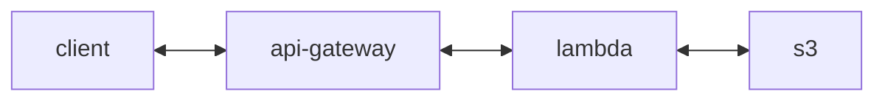
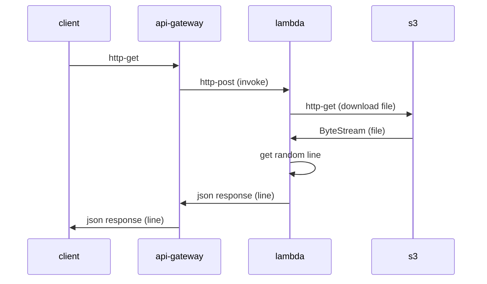
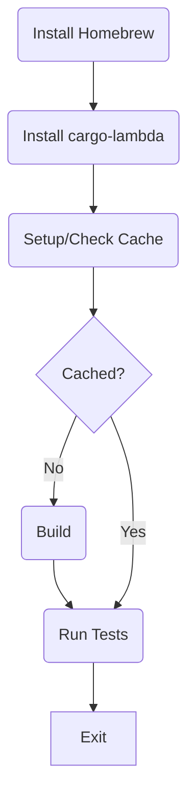
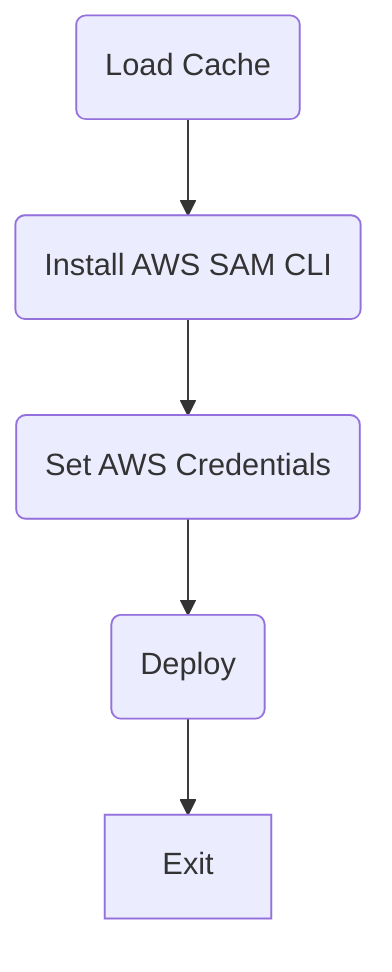

# Simple Rust Lambda

## Description

This is a simple AWS Lambda written in Rust that retrieves a file from an AWS S3 bucket and returns a random line from it.

### Data flow
<br>



### Sequence

I created this project to learn Rust with something more practical than typical "hello world!" example, and at the same time learn more about AWS in general. I use it to present inspriational/motivational messages on my blog - [Leader Kaizen](https://leaderkaizen.com/inspiration/). It's simple enough to grapple with but complex enough that I could learn useful aspects of the language that I could apply to extend the function or develop more complex solutions.

It utilises [Cargo Lambda](https://www.cargo-lambda.info/) which provides a set of tools for building Lambda's with Rust. It leverages the official [lambda_runtime](https://crates.io/crates/lambda_runtime) crate but it is considered a custom runtime as Rust is not natively supported by Lambda's yet.

This project contains:

- Rust source for Lambda event function
- [AWS SAM](https://aws.amazon.com/serverless/sam/) template for deploying Lambda and API Gateway REST API
- GitHub Actions to build the Lambda and deploy it and API using the SAM template

This project does **not** contain:

- Bucket creation - I used an existing bucket
- IAM user/role creation

This project **assumes**:

- Rust is installed
- AWS SAM CLI is installed and configured
- AWS user account used has relevant permissions. Below are built in policies that work but I recommend building custom policies with least privileges appropriate for the use case:

```
AWSLambda_FullAccess
AWSCloudFormationFullAccess
AmazonS3FullAccess
AmazonAPIGatewayAdministrator
```
- Arbitraty API usage plan and access using API key
<br><br>

## Getting Started

 
1. Install [Cargo Lambda](https://www.cargo-lambda.info/)
2. Based on your preferred shell, update [env.ps1](env.ps1) or [env.sh](env.sh) file with valid values (described [here](#environment-variables))

```
DO NOT COMMIT THESE FILES TO VERSION CONTROL. RECOMMEND ADDING TO .gitignore.
```

3. In a terminal, run:
    
    `cargo lambda watch`
4. In another terminal, run:
    
    `cargo lambda invoke --data-ascii '{}'`
<br><br>

### Environment Variables

|Key      | Description |
| ----------- | ----------- |
| S3_KEY_ID      | Key ID to access S3 bucket       |
| S3_KEY_SECRET   | Key secret to access S3 bucket        |
| BUCKET   | Bucket name        |
| REGION   | Bucket region       |
| FILE_PATH   | Full path to file, including filename and extension        |
<br>

### Notes

- Server runs on 127.0.0.1:9000
- Full url for function: http://127.0.0.1:9000/lambda-url/simple-rust-lambda/
- Because it is an *event* function is created so GET HTTP requests straight from the browser will **fail** - it is meant to be fronted by an API Gateway
<br><br>

## Optional

- Edit [template.yml](./template.yml) values as required (names, usage plan config, etc)
- I calling from browser, update CORS values
- If deploying using GitHub actions, create all keys and values in env files as secrets in the GitHub repo.
<br><br>

## Build & Release
This project includes build and release workflows for GitHub Actions. Build and release are split into seperate workflows with build artifacts being cached so the deploy workflow can be re-run without needing to rebuild.


### rust-cargo-build


### sam-deploy



## Todo

- [ ] Tool to generate env.* files based on prompts and automatically add to .gitignore
- [ ] Enable/disable CORS in Lambda
- [ ] Configurable log levels
- [ ] Improve error handling
- [ ] Add bucket creation to SAM template
<br><br>

## Feedback

As I'm learning Rust (and AWS for that matter), I welcome *constructive* feedback that will help me improve. Please consider reaching out to me on any of the social networks listed on my [profile page](https://github.com/slashrawr).